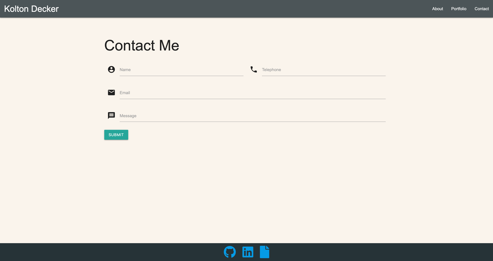

# Responsive-Portfolio

View Deployed Project here: https://koltondecker.github.io/Responsive-Portfolio/

This project displays a Materialize framework portfolio built from scratch and utilizes the responsive aspects of Materialize to make this website friendly for all devices. Responsive design ensures that web applications render well on a variety of devices and window or screen sizes. 
 
## About Me Page

 

 

## Projects Portfolio

 

 

## Contact Me Page

 

